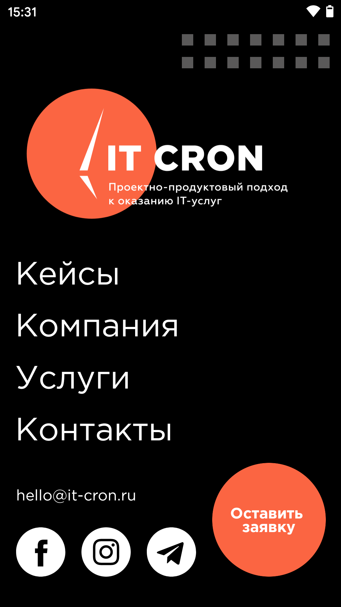
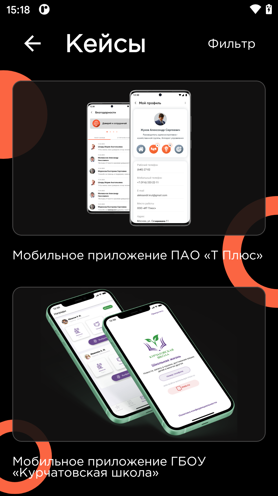
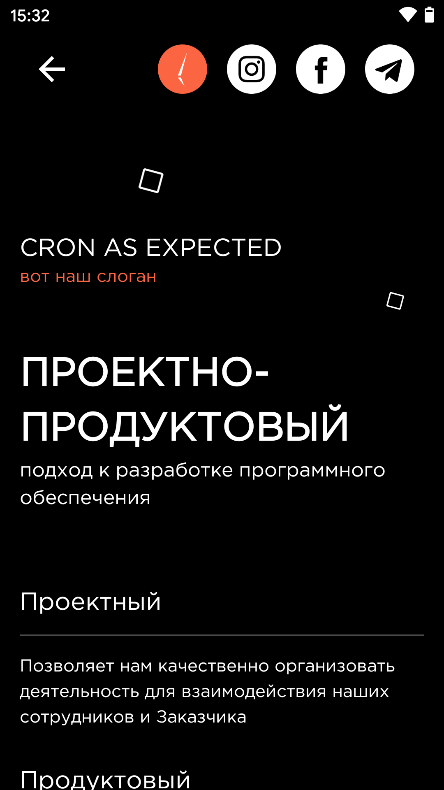
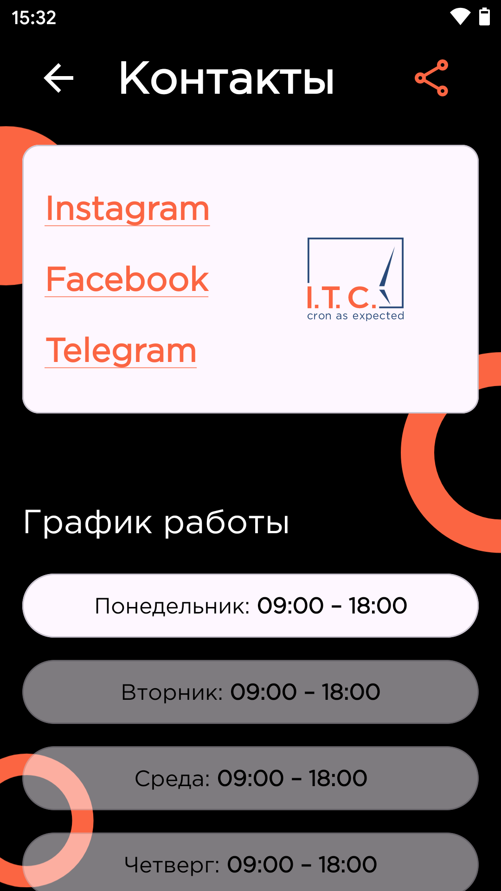
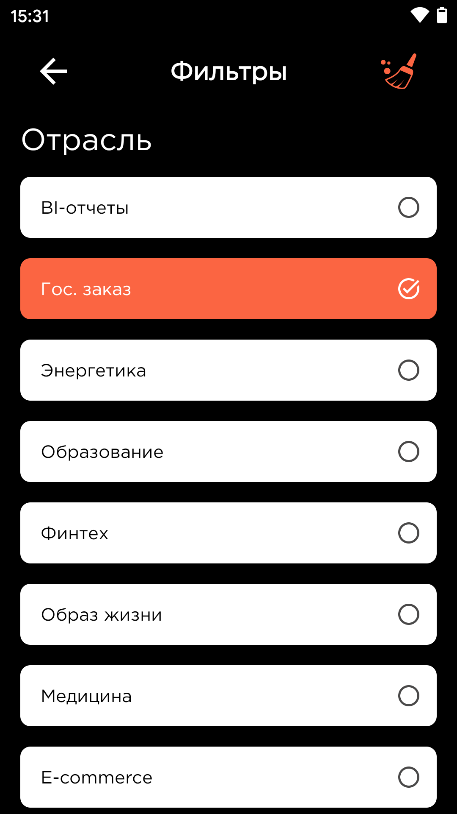

# Мобильное приложение IT CRON

Основные функции:

+ Информация о компании
+ Контактные данные
+ Портфолио компании
+ Список предоставляемых услуг
+ Оставить заявку для связи

#### Инструменты

+ Android Studio.
+ Kotlin.
+ Cicerone
+ Koin
+ Retrofit
+ Glide
+ Stories Progress View
+ Imagepicker
+ Firebase Analytics\Crashlitics
+ Gitlab, Fastlane, Bitrise

## Скриншоты
    